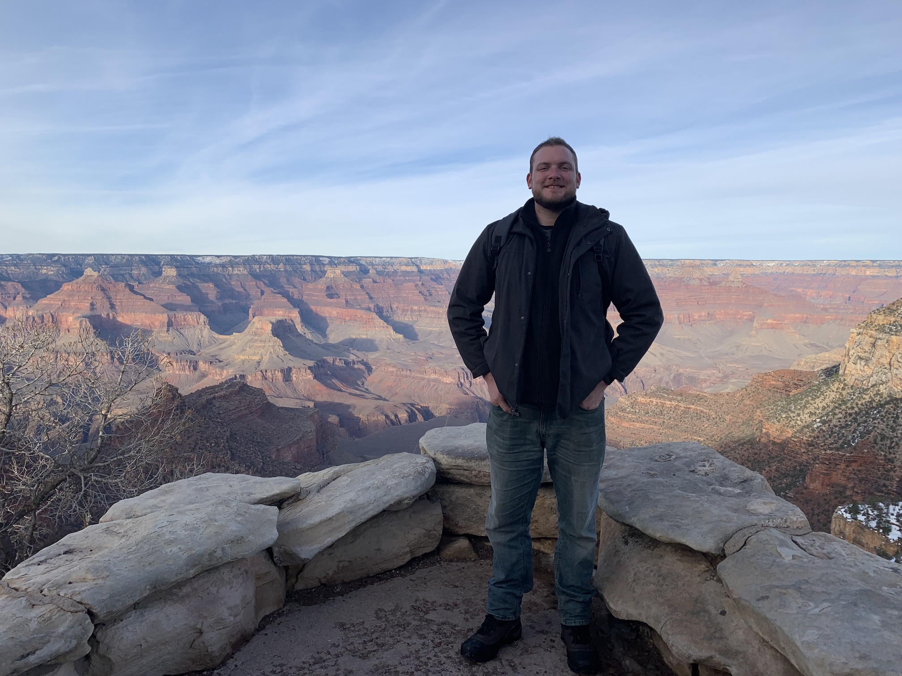

# About Me

I am a computer science graduate student at Texas State University. TODO

## Education

- MS Computer Science: Texas State University (August 2020 - Present)
- BS Computer Sciece with Math Minor: Texas State Univeristy (2016-2020)
- BS Biology with Chemistry Minor: Texas State University (2010)

## Skills

- C++
- C
- Python
- Java
- SQL
- shell
- AppleScript

## Interests

- TODO
  
## Employment

- TODO
  
## Awards

- TODO

Projects|Description
--------|-----------
[AppleScripts](https://github.com/kevin-funderburg/AppleScripts)|Personal project for `AppleScript` and `shell` script education
[dockerized-pytest-course](https://github.com/kevin-funderburg/dockerized-pytest-course)|Project to practice Test Driven Development using `pytest` and `Docker`
